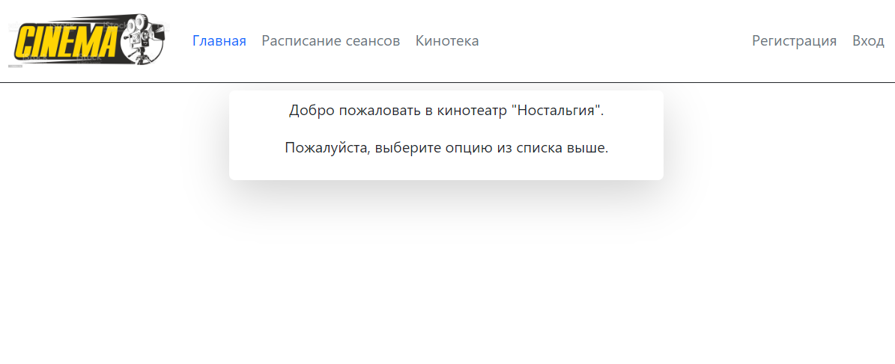
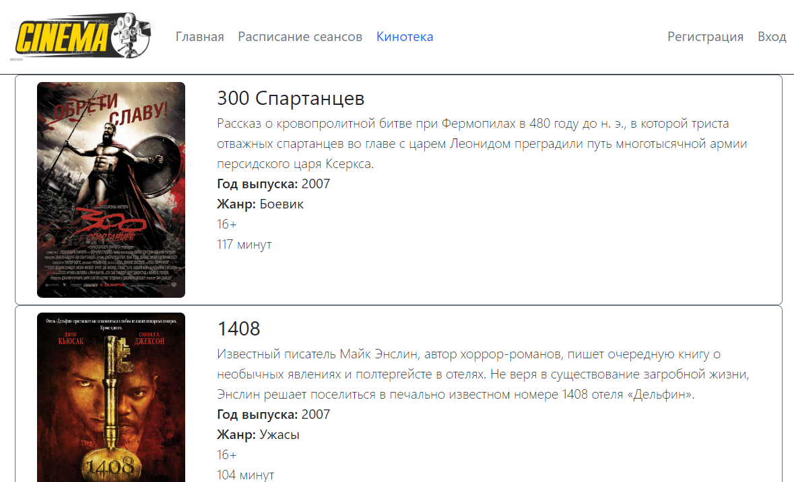
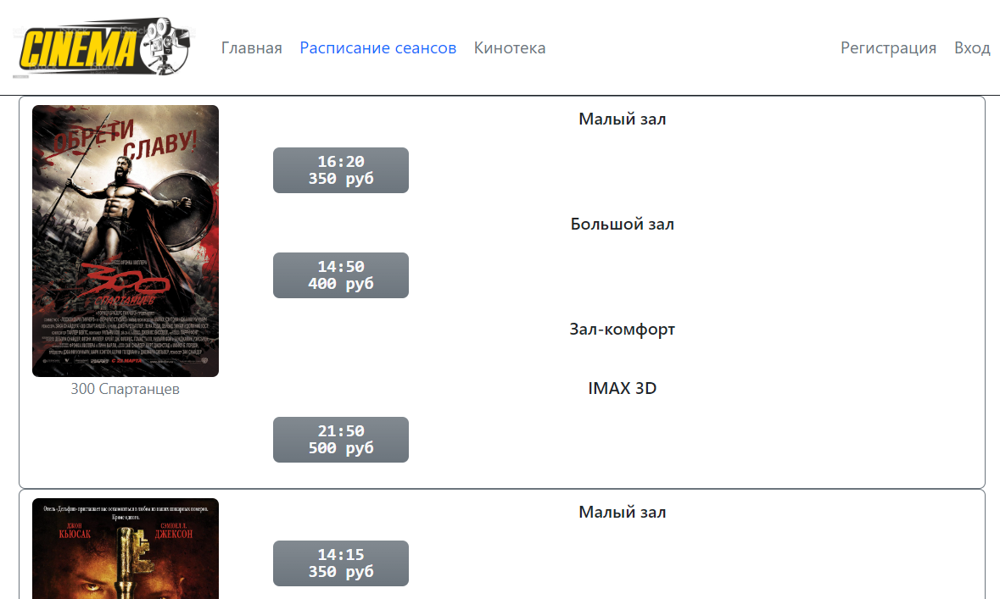
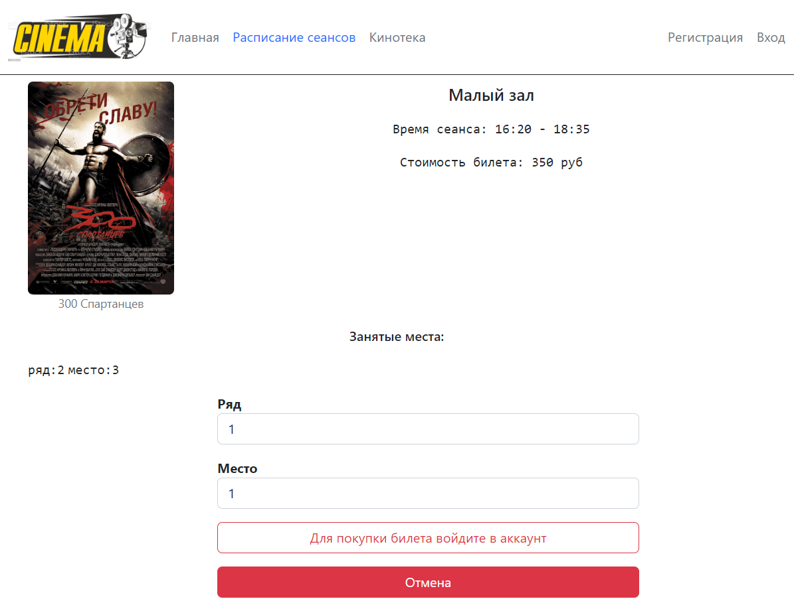
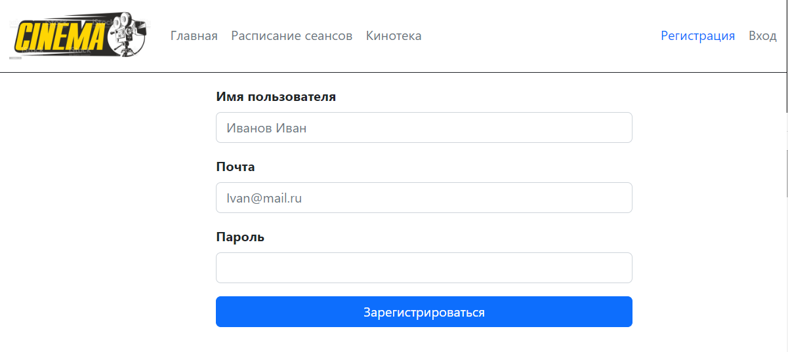
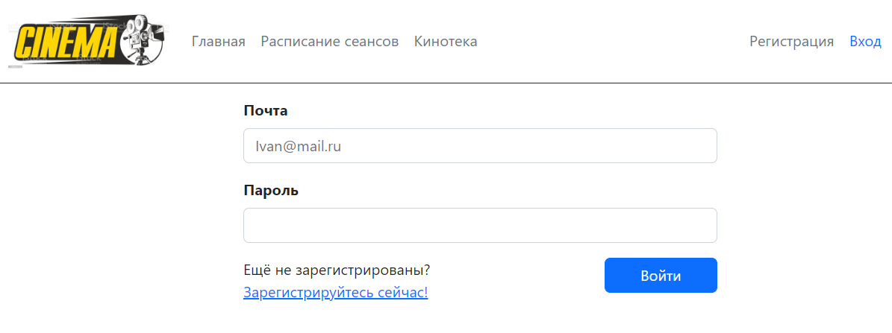
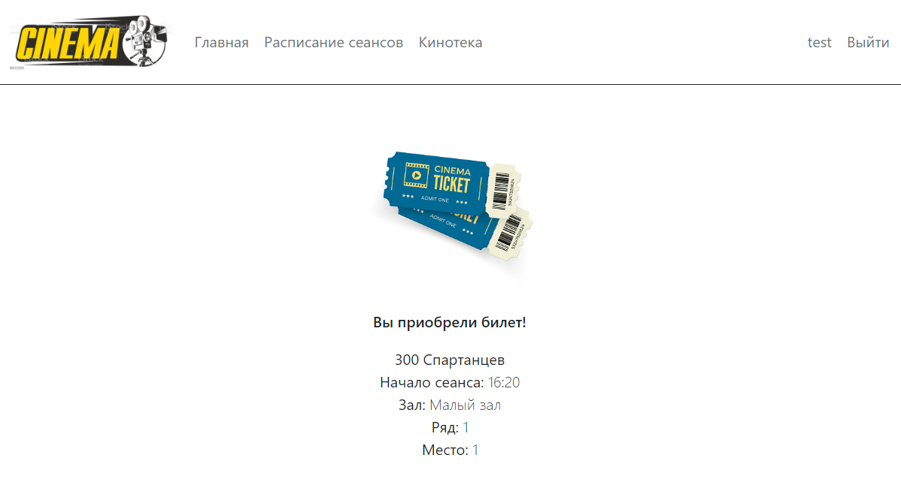

## job4j_cinema

В данном проекте представлена сервисная часть сайта для **покупки билетов в кинотеатр**.<br>
Покупка билетов доступна только для зарегистрированных пользователей, однако просмотр описания фильмов, 
находящихся в прокате, и доступных сеансов - доступны всем пользователям.<br>
Основная представленная логика: регистрация и вход, вывод киносеансов и фильмов, а также покупка билетов.<br>
База данных реализована следующими таблицами:
* **files** - файлы с постерами к фильмам и путь к ним;
* **film_sessions** - доступные сеансы; 
* **films** - прокатываемые фильмы;
* **genres** - все доступные в кинотеатре жанры;
* **halls** - залы, доступные для показа фильма;
* **tickets** - билеты, уже купленные на определённые сеансы фильмов, на конкретные места;
* **users** - пользователи, зарегистрированные на сайте.

Обращаю Ваше внимание, что все таблицы БД, за исключением _билетов_ и _пользователей_, заскриптованы и 
заполнены с помощью <u>liquibase</u> (см. папку db/scripts). Функции регистрации пользователей и покупки 
билетов позволяют заполнять соответствующие таблицы БД.

В качестве основного фреймворка используется **Spring Framework**.<br>
Страницы разработаны с помощью **Thymeleaf** и **Bootstrap**, а также использованы зависимости:
**PostgreSQL 42.5.4**, **Liquibase 4.15.0** и **Sql2o 1.6.0.**

<u>Требования к окружению</u>: **Java 17.0.2, PostgreSQL 14.0, Apache Maven 3.8.4**

##### Используемые технологии:
* Java 17
* Maven 3.8
* PostgreSQL 14
* Spring Boot
* Junit Jupiter
* AssertJ
* Mockito
* Liquibase 4
* Sql2o
* H2database
* Thymeleaf
* Bootstrap
* Checkstyle
* Log4J
* IntelliJ IDEA 2022.1.2

##### Запуск проекта:
```
1. Для запуска проекта, Вам необходимо клонировать проект из этого репозитория;
2. Затем необходимо создать локальную базу данных "cinema";
3. После - пропишите, пожалуйста, логин и пароль к созданной вами базе данных в файл db/liquibase.properties;
4. Далее запустите liquibase для предварительного создания и заполнения таблиц;
5. Запустите приложение одним из представленных ниже способов:
  5.1 Через класс Main, находящийся в папке src\main\java\ru\job4j\cinema;
  5.2 Скомпилировав и запустив проект через maven командой mvn spring-boot:run;
  5.3 Собрав проект через maven и запустив собранный файл командой java -jar job4j_cinema-1.0-SNAPSHOT.jar;
6. Открыть в браузере страницу http://localhost:8080/index;
7. Вы великолепны!
* Обращаю Ваше внимание, что при запуске проекта последним способом (п.5.3) могут отсутствовать изображения. В таком случае необходимо скопировать папку "files" в папку собранного проекта "target"
```
##### Доступные страницы:
**Главная страница, встречающая пользователя:**

**Описание всех фильмов, находящихся в прокате:**

**Список сеансов, для которых доступна покупка билетов:**

**Краткое описание сеанса и возможность выбрать ряд и место на которые Вы хотите приобрести билет:**

**Регистрация нового пользователя (с уникальным email):**

**Страница для входа под своей учётной записью:**

**И наконец, удачная покупка билета:**

Есть ещё страница с "неудачной покупкой билета", но кому она интересна, правда?

#### Искренне благодарю за внимание к моему проекту!

### Контакты для связи: 
> Захаренко Сергей <br>
email: Sergei.Rabota@gmail.com <br>
Telegram: @Niaktes <br>